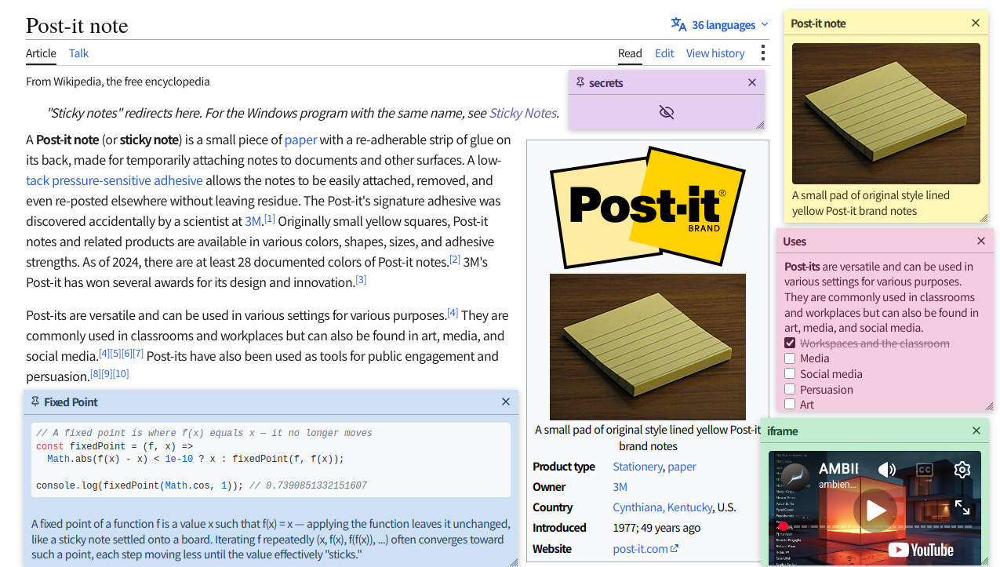

# Sticky Party

[](https://deepwiki.com/asano69/sticky-party)


- 個人またはチームで使用することのできるシンプルな付箋アプリです。
- 任意のWebサイトにシンプルな付箋を貼ることができます。
- バックエンドはGoサーバで、フロントエンドはブラウザ拡張機能として実装されています。

## Uses
- Webサイト／アプリを訪れたときに表示したい覚書き
- Web上のドキュメントの注釈

## Features
- 付箋内のURLの自動認識
- ユーザのモニターごとに、付箋の位置とサイズを記憶
- セキュリティ: 付箋はExtension page iframeとしてマウントされるため、Webサイトの管理者からも付箋の内容を読むことができません。[^1]
- **Sticky Note Blur for Sensitive Information**: Blur sensitive content displayed on sticky notes to help mitigate the risk of information theft by screen-capturing infostealers.
- 付箋のアクセスコントロールなし。登録済みユーザのみ、すべの付箋を自由に作成・編集・削除できます。
- 管理機能：管理者ユーザは、SQLiteに保存された付箋データをWebUIから操作できます。(PocketBase)


## Getting Started

### 1. 拡張機能のインストール  
#### Firefox:
- https://addons.mozilla.org/ja/firefox/addon/sticky-party/

#### Chrome:

### 2. バックエンドサーバのセットアップ

>[!NOTE]
>demoサーバがあります
>1. https://sticky-party.onrender.com にアクセスしてインスタンスを起動します(50秒)
>2. 管理者のメール:パスワードは、admin@mail.internal:password。デフォルトユーザのメール:パスワードは、user@mail.internal:passwordです。
>3. 15分で内容がリセットされます。

### 2.1  バックエンドサーバのデプロイ
```sh
git clone https://github.com/asano69/sticky-party.git
cd sticky-party
docker compose up -d
```

### 2.2. ユーザアカウントの作成
- 管理者アカウントとユーザアカウントが分けられています。1人で使う場合でも２種類作成する必要があります。
- ユーザアカウントの作成はCLIからも作成できますが、安全のため、Web UIから作成することを推奨します。
- 初期管理者アカウントはadmin@mail.internal:passwordなので、必ず変更してください。
```sh
docker exec -it sticky-party sticky-party --dir data user-upsert user@mail.internal userpassword
```

### 3. 拡張機能の設定
ブラウザを開き、Sticky Party拡張機能のポップアップを開き、接続情報の設定をする
- 作成したユーザメール
- パスワード
- サーバURL

### 4. 付箋を作成する

## How It Works
- 専用のフロントエンドは実装していないのでPocketBase管理画面からユーザを作成する。
- 拡張機能において、ユーザ（メールアドレス）とパスワードを設定する。（PocketBase SDKに使用）
- 拡張機能ボタンをおすと、新規付箋を作成するためのポップアップが開く。
- 付箋を貼りたいURLと本文を作成して保存ボタンを押すと、バックエンドサーバに付箋データが送信される。
- 付箋データをサーバに保存したあと、付箋を表示するURLのルールのみがローカルストレージにキャッシュされる。
- 任意のWebページを開くたびに、そのURLがルール集合に含まれている評価され、含まれる場合はDBから付箋データがロードされる。

## Tech Stack

### backend
- Go
- PocketBase v0.39+

### frontend
- wxt v0.21+
- solid.js v1.9
- kobalte v0.13+
- tailwind v4

[^1]: We use an extension page iframe because it runs in the extension's own origin (for example, `chrome-extension://...` in Chromium-based browsers and `moz-extension://...` in Firefox), which is isolated from the web page by the Same-Origin Policy. The page cannot directly access the iframe's DOM, JavaScript context, or extension data.
