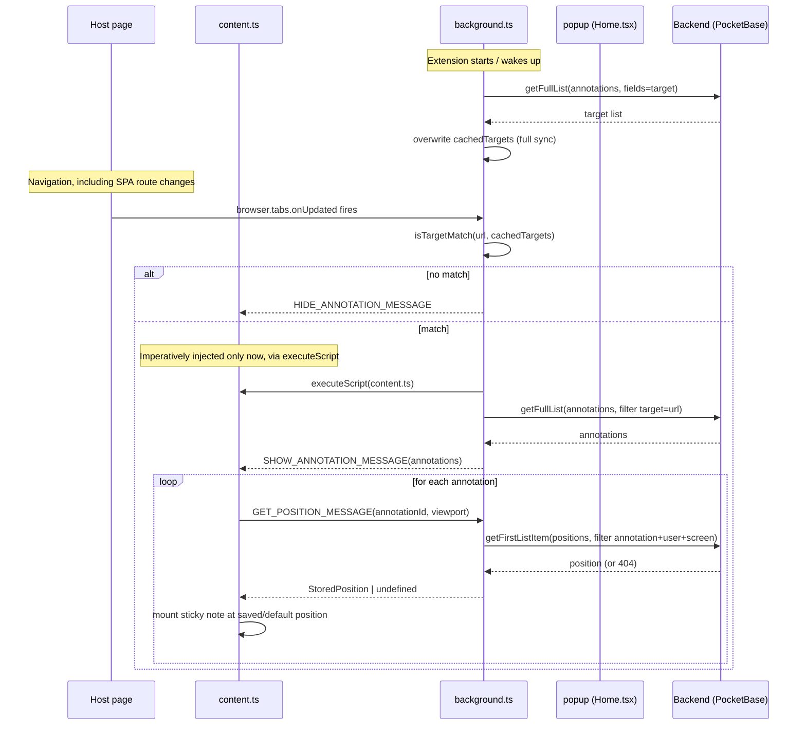

docs/communication-architecture.md
# Communication Architecture

This document describes how the three runtimes that make up Sticky Party
talk to each other: the **content script** (`entrypoints/content/index.ts`,
imperatively injected via `browser.scripting.executeScript` only into tabs
whose page matches a cached annotation target -- see `docs/architecture.md`'s
"content script の動的注入" section -- not statically injected on every
page; `background.ts` itself triggers that check directly off
`browser.tabs.onUpdated`), the **background script** (the MV3 service
worker), the **popup** (the extension's own privileged page), and the
**backend** (the Go server, exposing PocketBase's REST API).

For *why* the system is split this way, see `docs/architecture.md` (sync
design) and `docs/note-sizing.md` (note sizing). This document focuses on
*how the pieces talk*, i.e. the message-passing protocol itself.

## Why not talk to PocketBase directly from content.ts?

Only the **background script** and the **popup** call PocketBase
(`lib/pb.ts`, `lib/annotations.ts`, `lib/positions.ts`, `lib/targets.ts`).
The content script never does, even though it needs annotation bodies and
saved positions.

This is not just style — in Firefox, a content script's own network
requests are attributed to the **host page's origin**, not the
extension's. That caused two concrete failures once the extension was
installed as a real add-on (not run via `wxt dev`):

- Firefox's Local Network Access check treated a `fetch()` from inside
  `content.ts` as coming from `https://en.wikipedia.org`, and blocked
  it from reaching `localhost:3000`.
- The PocketBase SDK's internal objects triggered
  `Not allowed to define cross-origin object as property on ... XrayWrapper`,
  a Firefox-specific isolation error between the content script's sandbox
  and the host page's DOM.

The background script and popup are both privileged extension contexts,
so neither issue applies there. `content.ts` therefore never calls
PocketBase itself; it always asks the background script to do it, via
`browser.runtime.sendMessage`.

## Sequence diagram


    Note over Content: User drags or resizes a note
    Content->>BG: SAVE_POSITION_MESSAGE(annotationId, position, viewport)
    BG->>PB: create/update(positions)
    PB-->>BG: record id
    BG-->>Content: record id

    Note over Popup: User saves a new annotation
    Popup->>PB: create(annotations, {target, body})
    PB-->>Popup: created record
    Popup->>Popup: addCachedTarget(target)  (write-through)
    Popup->>BG: CHECK_ANNOTATION_MESSAGE(url, tabId)
    BG->>PB: getFullList(annotations, filter target=url)
    PB-->>BG: annotations
    BG-->>Content: SHOW_ANNOTATION_MESSAGE(annotations)
```

## The message types

All message shapes live in two files, so both ends of every channel stay
in sync:

- `lib/messages.ts` — content ⇄ background: annotation visibility
  (`SHOW_ANNOTATION_MESSAGE`, `HIDE_ANNOTATION_MESSAGE`,
  `CHECK_ANNOTATION_MESSAGE`) and position access
  (`GET_POSITION_MESSAGE`, `SAVE_POSITION_MESSAGE`).
- `lib/iframe-messages.ts` — a separate protocol between `content.ts` and
  each note's `annotation-iframe` (title/body editing, resize
  reporting). Not covered by the diagram above, since it never touches
  the backend — see `docs/note-sizing.md` for that flow.

## Two different communication shapes, on purpose

The traffic above is not one bidirectional channel; it is two
one-directional patterns layered together, and each uses the API suited
to it:

- **content → background is request/response.** `GET_POSITION_MESSAGE`,
  `SAVE_POSITION_MESSAGE`, and `CHECK_ANNOTATION_MESSAGE` all go through
  `browser.runtime.sendMessage()`, whose returned Promise resolves with
  whatever the background listener returns. This gives request/response
  correlation for free.
- **background → content is a push to one tab.** `SHOW_ANNOTATION_MESSAGE`
  / `HIDE_ANNOTATION_MESSAGE` go through
  `browser.tabs.sendMessage(tabId, ...)`, which already resolves "which
  tab" without any connection bookkeeping.

A `browser.runtime.connect()` port was considered and rejected: it has no
built-in request/response correlation (you'd hand-roll request IDs), and
a port's connection state does not survive the MV3 service worker being
killed for inactivity — exactly the lifecycle problem `browser.alarms`
already works around elsewhere (see `docs/architecture.md`). Plain
`sendMessage` calls are stateless per call, so a woken-up service worker
can answer them with no reconnect logic needed.

## `ViewportInfo`: why position data crosses two hops

`x`/`y` are persisted as ratios of the browser window's inner size (see
`lib/positions.ts`), so restoring a note keeps it in the same relative
spot regardless of window size. That ratio math has to use the **content
page's** `window.innerWidth`/`innerHeight` -- not the background
script's, which has none of its own. (`ViewportInfo` used to also carry
`screen.width`/`height` to partition saved positions per display, but
browser zoom changes the apparent screen size, so that partition was
removed -- see `lib/positions.ts`'s header comment.)

Since `lib/positions.ts` runs in the background script (per the section
above), `content.ts` captures its own viewport synchronously
(`currentViewport()`) and sends it along with every
`GET_POSITION_MESSAGE`/`SAVE_POSITION_MESSAGE`. This is why the sequence
diagram shows `viewport` as part of both position messages: without it,
`toRatio`/`fromRatio` would silently compute against the wrong window.
